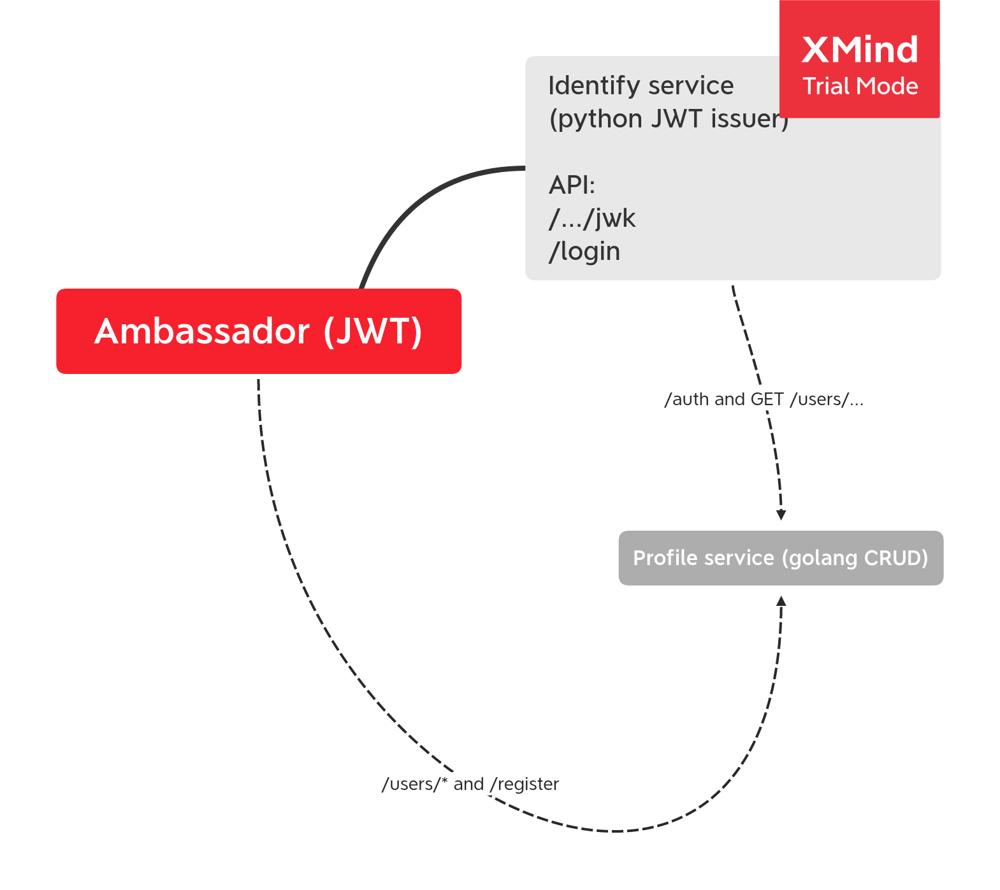

# Домашнее задание
* Реализовать клиентскую аутентификацию и авторизацию с помощью api gateway.
* Добавить в приложение аутентификацию и регистрацию пользователей.

* Реализовать сценарий "Изменение и просмотр данных в профиле клиента".
* Пользователь регистрируется. Заходит под собой и по-определенному URL получает данные о своем профиле. Может поменять данные в профиле. Данные профиля для чтения и редактирования не должны быть доступны другим клиентам (аутентифицированным или нет).

## На выходе должно быть

* описание архитектурного решения и схема взаимодействия сервисов (в виде картинки)
* команда установки приложения (из helm-а или из манифестов). Обязательно указать в каком namespace нужно устанавливать.
* команда установки api-gateway, если он отличен от nginx-ingress.
* тесты Postman, которые прогоняют сценарий:
    - регистрация пользователя 1
    - проверка, что изменение и получение профиля пользователя недоступно без логина
    - вход пользователя 1
    - изменение профиля пользователя 1
    - проверка, что профиль поменялся
    - выход* (если есть)
    - регистрация пользователя 2
    - вход пользователя 2
    - проверка, что пользователь2 не имеет доступа на чтение и редактирование профиля пользователя1.

* в тестах обязательно
    - наличие {{baseUrl}} для URL
    - использование домена arch.homework в качестве initial значения {{baseUrl}}
    - использование сгенерированных случайно данных в сценарии
    - отображение данных запроса и данных ответа при запуске из командной строки с помощью newman.

# Решение

Шлюзом выступает амбассадор. Есть сервис на питоне identity (переделанный скрипт из лаб) для выдачи JWT. Есть Profile сервис, реализующий круд юзеров.
POST /register - урл перенаправляет на POST /users сервиса Profile для регистрации юзера
POST /login - отправляется шлюзом на Identity, который далее делает запросы тоже на Profile для проверки пароля и получения данных юзера
POST /users - отправляется на Profile с проверкой JWT

# Действия

create and set namespace

    kubectl create namespace gateway
    kubectl config set-context --current --namespace=gateway

install prometheus and nginx

    helm install prom stable/prometheus-operator -f homework/7-prometheus/prometheus.yaml --atomic

install ambassador

    helm install nginx stable/nginx-ingress -f homework/9-gateway/nginx-ingress.yaml
    
    helm repo add datawire https://getambassador.io
    helm install aes datawire/ambassador -f ambassador_values.yaml

install profile storage app

    helm install profile homework/9-gateway/profile/profile-chart/
    # or
    cd homework/9-gateway/profile
    skaffold run

install identity app

    helm install profile homework/9-gateway/identity/identity-chart/
    # or
    cd homework/9-gateway/profile
    skaffold run

apply ambassador manifests

    kubectl apply -f ambassador/
    
run newman (fish shell and maybe you need to change base url or port)

    docker run --net=host -v (pwd):/etc/newman -t postman/newman run homework.postman_collection.json --env-var "baseUrl=http://arch.homework:31646"